# ✈️ Awesome Airline Operations Management 🛫

  
  
  
  
  

## 🌐 Overview & Industry Index

Welcome to the **Awesome Airline Operations Management** ecosystem repository — a curated catalog of top **SaaS platforms**, **Flight Operations Control Center (OCC) systems**, **Crew Planning & Pairing Optimizers**, and **Open-Source Aviation Software**.

Whether you are an airline operations controller, flight dispatcher, crew planner, aviation software engineer, or researcher, this repository indexes production software suites and open-source tools driving modern air transport logistics, disruption recovery, and flight scheduling.

---

## 📑 Table of Contents

- [📊 SaaS & Commercial Platforms](#-saas--commercial-platforms)
- [💻 Open-Source GitHub Projects](#-open-source-github-projects)
- [🛠️ Key Functional Domains](#️-key-functional-domains)
- [🤝 How to Contribute](#-how-to-contribute)
- [⚖️ Regulatory & Safety Disclaimer](#-regulatory--safety-disclaimer)
- [💖 Support & Sponsor](#-support--sponsor)
- [📈 Star History](#-star-history)

---

## 📊 SaaS & Commercial Platforms

> 📊 **Market Size & Industry Dynamics**: The global **Airline Operations & Flight Management Software Market** is estimated at **$9.5 Billion – $14.0 Billion** (growing at a ~7.2% CAGR). The enterprise scheduled airline sector is **moderately concentrated** among top-tier aviation IT conglomerates (*Boeing/Jeppesen, NAVBLUE/Airbus, Amadeus, Sabre, Lufthansa Systems*), whereas the Part-135 charter, cargo, and regional business aviation segment remains **moderately fragmented** with agile niche SaaS solutions.

Below is the curated list of leading enterprise SaaS platforms, **sorted by company size / revenue / valuation (descending)**:

| 🏢 Platform / Vendor | 💰 Company Size / Valuation | 🏷️ Specific Starting Pricing | 🎁 Free Tier / Free Trial Limits | ⚡ Key Operational Focus & Capabilities |
| :--- | :--- | :--- | :--- | :--- |
| **[Boeing / Jeppesen Crew Planning](https://www.jeppesen.com/)** ✈️ | **~$77.0 Billion** *(Boeing Parent Rev)* | Enterprise quote starting at **~$50,000 / year** (scaled per pilot/fleet count) | **No free tier**; 30-day enterprise evaluation & sandbox access upon request | World-class crew pairing, rostering, disruption solver & flight ops planning |
| **[NAVBLUE (Airbus)](https://www.navblue.aero/)** 🛫 | **~$70.0 Billion** *(Airbus Parent Rev)* | Custom tier starting at **~$35,000 / year** + $15 per flight leg | **No free tier**; 14-day guided proof-of-concept & simulator sandbox for carriers | Flight operations, electronic flight bag (EFB), OCC dispatch & navigation data |
| **[Amadeus Sky Suite](https://amadeus.com/en/portfolio/airlines)** 🌐 | **~$5.8 Billion** *(Amadeus IT Rev)* | Modular enterprise tier starting at **~$40,000 / year** | **No free tier**; 30-day staging demo access for airline IT decision teams | Network schedule planning, flight management & PSS/OCC integration |
| **[Merlot Aero (CAE)](https://www.cae.com/)** 👨‍✈️ | **~$3.2 Billion** *(CAE Parent Rev)* | Cloud ops tier starting at **$800 / month** (~$9,600/yr) for regional ops | **No free tier**; 14-day evaluation sandbox for airline flight ops managers | Cloud-based crew management, aircraft tracking & disruption forecasting |
| **[Sabre AirCentre / Operations](https://www.sabre.com/products/aircentre/)** 🔄 | **~$2.9 Billion** *(Sabre Corp Rev)* | Enterprise subscription starting at **~$30,000 / year** | **No free tier**; 30-day interactive demo portal upon executive evaluation | Operations control, flight dispatch, crew management & movement control |
| **[IBS iFlight (IBS Software)](https://www.ibsplc.com/)** 📦 | **~$1.5 Billion** *(Valuation / ~$300M Rev)* | SaaS enterprise tier starting at **~$25,000 / year** | **No free tier**; 30-day test drive sandbox access for scheduled airlines | End-to-end OCC flight management, crew tracking & maintenance ops |
| **[Lufthansa Systems NetLine](https://www.lhsystems.com/)** 📡 | **~$650 Million** *(Lufthansa Sys Rev)* | Enterprise tier starting at **~$25,000 / year** for regional carriers | **No free tier**; 30-day sandbox trial environment for scheduled airlines | Operations control (NetLine/Ops), schedule management & crew leg-solver |
| **[FLYR Labs](https://flyr.com/)** 🤖 | **~$500+ Million** *(Valuation)* | SaaS tier starting at **$1,500 / month** (~$18,000/yr) | **No free tier**; 14-day flight schedule data simulation & optimization trial | AI-driven revenue management, flight schedule optimization & OCC decision support |
| **[Navitaire (Amadeus LCC)](https://www.navitaire.com/)** 🎫 | **~$300 Million** *(Annual Rev)* | SaaS starting at **~$15,000 / year** base + usage per flight leg | **No free tier**; 30-day LCC staging environment access | Low-cost carrier (LCC) operations, flight departure control & passenger service |
| **[Rusada ENVISION](https://www.rusada.com/)** 🛠️ | **~$20 Million** *(Annual Rev)* | Commercial fleet tier starting at **$1,200 / month** (~$14,400/yr) | **No free tier**; 14-day guided software demo & interactive trial | Aviation MRO, fleet maintenance tracking & operational flight log alignment |
| **[Leon Software](https://www.leonsoftware.com/)** 🛩️ | **~$15 Million** *(Annual Rev)* | Starter tier starting at **$220 / month** ($2,640/yr) for up to 2 aircraft | **No free tier**; 30-day fully functional free trial (max 3 aircraft) | Charter & Part-135 flight scheduling, crew rostering & OPS dispatch workflow |
| **[Airpas (Sabre)](https://www.airpas.com/)** 💳 | **~$15 Million** *(Annual Rev)* | Direct cost management tier starting at **$1,000 / month** (~$12,000/yr) | **No free tier**; 14-day demo access for airline cost control teams | Operational cost management, route profitability & airport fee automation |
| **[Awery Aviation Software](https://awery.aero/)** 📋 | **~$10 Million** *(Annual Rev)* | SaaS starter plan starting at **$450 / month** (~$5,400/yr) | **No free tier**; 14-day free trial with sample fleet & flight schedule data | Integrated ERP for charter, cargo airline ops, crew planning & CRM |

---

## 💻 Open-Source GitHub Projects

> 🌟 **Open-Source Status**: Certified commercial airline operations rely heavily on enterprise solutions due to strict regulatory oversight (FAR/EASA crew legality, fatigue management, real-time ACARS dispatch). However, open-source projects thrive in **ADS-B tracking**, **virtual airline management (FSX/MSFS)**, **crew pairing research**, and **ACARS message decoding**.

Below is the complete list of open-source projects, **sorted by GitHub_Stars (descending)**:

| 📦 Repository & Link | 🌟 Stars_Count | 📝 Description & Technical Scope |
| :--- | :--- | :--- |
| **[antirez/dump1090](https://github.com/antirez/dump1090)** |  | Lightweight C-based Mode S decoder for RTLSDR devices used in real-time aircraft tracking feeds. |
| **[FlightGear/flightgear](https://github.com/FlightGear/flightgear)** |  | Open-source flight simulator engine and flight dynamics framework for flight ops testing and research. |
| **[wiedehopf/tar1090](https://github.com/wiedehopf/tar1090)** |  | High-performance web UI for ADS-B tracking decoders (`readsb` / `dump1090-fa`) used in OCC dashboards. |
| **[wiedehopf/readsb](https://github.com/wiedehopf/readsb)** |  | Ultra-fast C-based ADS-B / Mode-S decoder for aircraft tracking and flight data stream processing. |
| **[phpvms/phpvms](https://github.com/phpvms/phpvms)** |  | Laravel-based Virtual Airline Management system (PIREPs, flight schedules, pilot rosters & fleet tracking). |
| **[TLeconte/acarsdec](https://github.com/TLeconte/acarsdec)** |  | Multi-channel ACARS (Aircraft Communications Addressing and Reporting System) decoder software for SDRs. |
| **[openskynetwork/pyopensky](https://github.com/openskynetwork/pyopensky)** |  | Python interface to the OpenSky Network for querying live and historical ADS-B flight traffic data. |
| **[sasa-radovanovic/ff-crew-management-system](https://github.com/sasa-radovanovic/ff-crew-management-system)** |  | Full-stack web prototype modeling airline crew pairing, fleet management, and pilot flight scheduling. |
| **[YAAMSOrg/yaams-server](https://github.com/YAAMSOrg/yaams-server)** |  | Open-source server backend for Yet Another Airline Management System (virtual airline pilot dispatch). |
| **[mani-mal/crewml](https://github.com/mani-mal/crewml)** |  | Machine learning and optimization algorithms for airline crew pairing optimization and scheduling research. |
| **[265-airport-operations-management](https://github.com/worlds-biggest-software-project/265-airport-operations-management)** |  | Open conceptual framework modeling airport operations database (AODB), gate assignment & ground dispatch. |

---

## 🛠️ Key Functional Domains

1. 👨‍✈️ **Crew Planning & Rostering**: Solves complex pairing, duty-period legality (FAR Part 117 / EASA ORO.FTL), fatigue risk management, and pilot bidding.
2. 📡 **Operations Control Center (OCC)**: Real-time aircraft movement tracking, disruption handling, slot management, and delay propagation mitigation.
3. 🛫 **Flight Dispatch & Navigation**: Flight plan generation, weather updates (METAR/TAF), NOTAM parsing, and fuel optimization.
4. ⚙️ **Maintenance & Engineering (MRO)**: Aircraft status logging, Minimum Equipment List (MEL) tracking, and airworthiness compliance.
5. 📊 **Direct Operational Cost Control**: Airport fee calculations, overflight charge verification, and fuel contract accounting.

---

## 🤝 How to Contribute

We welcome contributions from airline software engineers, flight ops specialists, and open-source maintainers!

1. 🍴 **Fork** this repository.
2. 📝 **Add or update** entries in `README.md` following our structured tabular format.
3. 🔗 Ensure all SaaS and GitHub project links are active and descriptions remain objective and accurate.
4. 🚀 **Submit a Pull Request** with a brief summary of the changes.

---

## ⚖️ Regulatory & Safety Disclaimer

> ⚠️ **Important Safety Notice**: Airline operations software directly influences flight safety, crew legality compliance, and airworthiness. Open-source repositories listed here are intended strictly for **research, educational purposes, or virtual flight simulation**. Do NOT use uncertified open-source packages for live Part-121 or Part-135 commercial airline dispatch or crew legality monitoring without formal aviation authority approval.

---

## 💖 Support & Sponsor

Thank you for exploring the **Awesome Airline Operations Management** ecosystem repository! If you find this curated list valuable for your research, project development, or industry knowledge, please consider supporting the project:

- ⭐ **Star** this repository to show your support and increase its visibility.
- 🍴 **Fork** it to keep a copy and contribute your own additions or enhancements.
- 📢 **Share** it with your fellow aviation software developers, flight ops controllers, and researchers.

☕ If you'd like to support the ongoing maintenance and curation of open-source aviation resources, you can **Sponsor or Buy Me a Coffee**:

---

## 📈 Star History

---

  <b>⭐ Star this repository if you find it useful for airline software research! ⭐</b>

